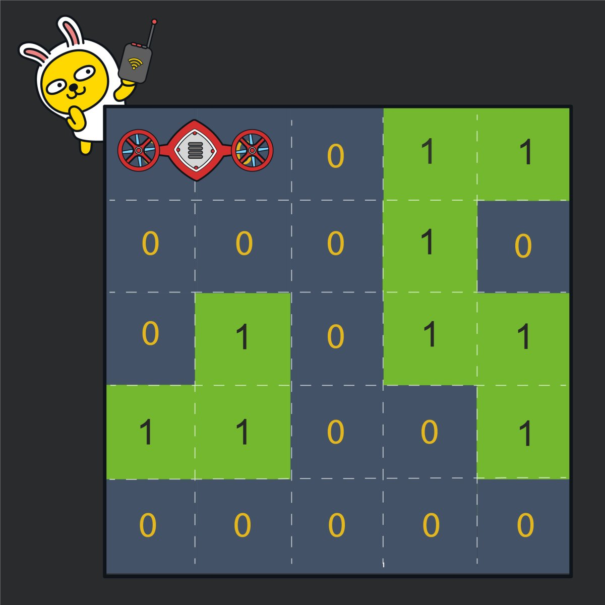
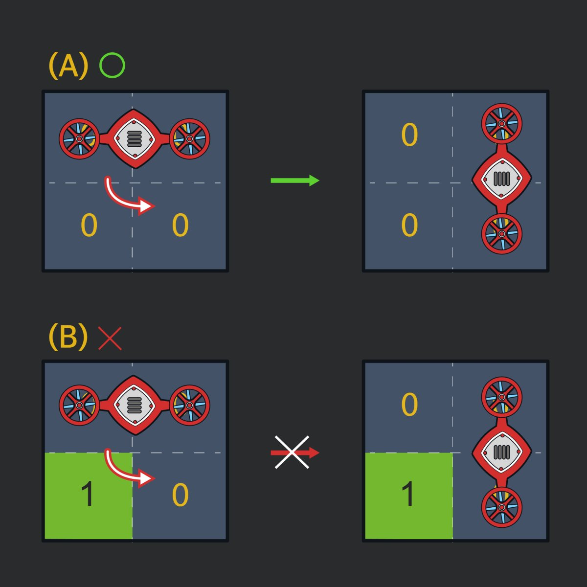

# 200829 60063 블록 이동하기

###### 문제 설명

로봇개발자 **무지**는 한 달 앞으로 다가온 카카오배 로봇경진대회에 출품할 **로봇**을 준비하고 있습니다. 준비 중인 로봇은 **`2 x 1`** 크기의 로봇으로 무지는 **0**과 **1**로 이루어진 **`N x N`** 크기의 지도에서 **`2 x 1`** 크기인 로봇을 움직여 **(N, N)** 위치까지 이동 할 수 있도록 프로그래밍을 하려고 합니다. 로봇이 이동하는 지도는 가장 왼쪽, 상단의 좌표를 **(1, 1)**로 하며 지도 내에 표시된 숫자 **0**은 빈칸을 **1**은 벽을 나타냅니다. 로봇은 벽이 있는 칸 또는 지도 밖으로는 이동할 수 없습니다. 로봇은 처음에 아래 그림과 같이 좌표 **(1, 1)** 위치에서 가로방향으로 놓여있는 상태로 시작하며, 앞뒤 구분없이 움직일 수 있습니다.



로봇이 움직일 때는 현재 놓여있는 상태를 유지하면서 이동합니다. 예를 들어, 위 그림에서 오른쪽으로 한 칸 이동한다면 **(1, 2), (1, 3)** 두 칸을 차지하게 되며, 아래로 이동한다면 **(2, 1), (2, 2)** 두 칸을 차지하게 됩니다. 로봇이 차지하는 두 칸 중 어느 한 칸이라도 **(N, N)** 위치에 도착하면 됩니다.

로봇은 다음과 같이 조건에 따라 회전이 가능합니다.



위 그림과 같이 로봇은 90도씩 회전할 수 있습니다. 단, 로봇이 차지하는 두 칸 중, 어느 칸이든 축이 될 수 있지만, 회전하는 방향(축이 되는 칸으로부터 대각선 방향에 있는 칸)에는 벽이 없어야 합니다. 로봇이 한 칸 이동하거나 90도 회전하는 데는 걸리는 시간은 정확히 1초 입니다.

**0**과 **1**로 이루어진 지도인 board가 주어질 때, 로봇이 **(N, N)** 위치까지 이동하는데 필요한 최소 시간을 return 하도록 solution 함수를 완성해주세요.

### 제한사항

- board의 한 변의 길이는 5 이상 100 이하입니다.
- board의 원소는 0 또는 1입니다.
- 로봇이 처음에 놓여 있는 칸 (1, 1), (1, 2)는 항상 0으로 주어집니다.
- 로봇이 항상 목적지에 도착할 수 있는 경우만 입력으로 주어집니다.

------

### 입출력 예

| board                                                        | result |
| ------------------------------------------------------------ | ------ |
| [[0, 0, 0, 1, 1],[0, 0, 0, 1, 0],[0, 1, 0, 1, 1],[1, 1, 0, 0, 1],[0, 0, 0, 0, 0]] | 7      |

### 입출력 예에 대한 설명

문제에 주어진 예시와 같습니다.
로봇이 오른쪽으로 한 칸 이동 후, (1, 3) 칸을 축으로 반시계 방향으로 90도 회전합니다. 다시, 아래쪽으로 3칸 이동하면 로봇은 (4, 3), (5, 3) 두 칸을 차지하게 됩니다. 이제 (5, 3)을 축으로 시계 방향으로 90도 회전 후, 오른쪽으로 한 칸 이동하면 (N, N)에 도착합니다. 따라서 목적지에 도달하기까지 최소 7초가 걸립니다.

---

## 200829 Code
```python
def solution(board):
    def check_shape(shape):
        nonlocal q, visited
        type = 0
        if shape == 0:
            type = 1
        if {(rx2, ry2), (nrx2, nry2)} not in visited:
            q.append((rx2, ry2, nrx2, nry2, type, time+1))
            visited.append({(rx2, ry2), (nrx2, nry2)})
        if {(rx1, ry1), (nrx1, nry1)} not in visited:
            q.append((rx1, ry1, nrx1, nry1, type, time + 1))
            visited.append({(rx1, ry1), (nrx1, nry1)})


    answer = 0
    N = len(board)
    q = deque()
    q.append((0, 0, 0, 1, 0, 0))
    visited = []
    visited.append({(0, 0), (0, 1)})
    di = [0, 1, 0, -1]
    dj = [1, 0, -1, 0]
    while q:
        rx1, ry1, rx2, ry2, type, time = q.popleft()
        if rx1 == ry1 == N-1 or rx2 == ry2 == N-1:
            answer = time
            break
        for k in range(4):
            nrx1, nry1 = rx1 + di[k], ry1 + dj[k]
            nrx2, nry2 = rx2 + di[k], ry2 + dj[k]
            if 0 <= nrx1 < N and 0 <= nry1 < N and 0 <= nrx2 < N and 0 <= nry2 < N \
                    and not board[nrx1][nry1] and not board[nrx2][nry2]:
                if {(nrx1, nry1), (nrx2, nry2)} not in visited:
                    q.append((nrx1, nry1, nrx2, nry2, type, time+1))
                    visited.append({(nrx1, nry1), (nrx2, nry2)})
                if not type and k in [1, 3]:
                    check_shape(0)
                elif type and k in [0, 2]:
                    check_shape(1)
    return answer
```


## 200529 Code

```python
from collections import deque

def solution(board):
    answer = 0
    N = len(board)
    di = [0, 0, 1, -1]
    dj = [1, -1, 0, 0]
    visited = []

    q = deque()
    q.append((0, 0, 0, 1, 0, 1))
    visited.append({(0, 0), (0, 1)})

    while q:
        rxo, ryo, rxt, ryt, cnt, shape = q.popleft()
        if rxo == ryo == N-1 or rxt == ryt == N-1:
            answer = cnt
            break

        for k in range(4):
            nxo, nyo = rxo + di[k], ryo + dj[k]
            nxt, nyt = rxt + di[k], ryt + dj[k]

            if 0 <= nxo < N and 0 <= nyo < N and 0 <= nxt < N and 0 <= nyt < N and \
                    not board[nxo][nyo] and not board[nxt][nyt]:
                if {(nxo, nyo), (nxt, nyt)} not in visited:
                    visited.append({(nxo, nyo), (nxt, nyt)})
                    if shape:
                        q.append((nxo, nyo, nxt, nyt, cnt+1, 1))
                    elif not shape:
                        q.append((nxo, nyo, nxt, nyt, cnt + 1, 0))
                if shape:
                    if k == 2 or k == 3:
                        if {(rxo, ryo), (nxo, nyo)} not in visited:
                            visited.append({(rxo, ryo), (nxo, nyo)})
                            q.append((rxo, ryo, nxo, nyo, cnt + 1, 0))

                        if {(nxt, nyt), (rxt, ryt)} not in visited:
                            visited.append({(nxt, nyt), (rxt, ryt)})
                            q.append((nxt, nyt, rxt, ryt, cnt + 1, 0))
                else:
                    if k == 0 or k == 1:
                        if {(rxo, ryo), (nxo, nyo)} not in visited:
                            visited.append({(rxo, ryo), (nxo, nyo)})
                            q.append((rxo, ryo, nxo, nyo, cnt + 1, 1))

                        if {(nxt, nyt), (rxt, ryt)} not in visited:
                            visited.append({(nxt, nyt), (rxt, ryt)})
                            q.append((nxt, nyt, rxt, ryt, cnt + 1, 1))
    return answer
```

