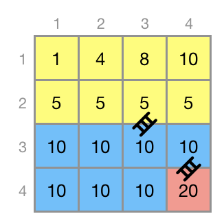
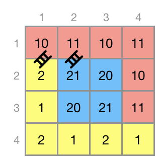

# 200605 62050 지형 이동

###### 문제 설명

N x N 크기인 정사각 격자 형태의 지형이 있습니다. 각 격자 칸은 1 x 1 크기이며, 숫자가 하나씩 적혀있습니다. 격자 칸에 적힌 숫자는 그 칸의 높이를 나타냅니다.

이 지형의 아무 칸에서나 출발해 모든 칸을 방문하는 탐험을 떠나려 합니다. 칸을 이동할 때는 상, 하, 좌, 우로 한 칸씩 이동할 수 있는데, 현재 칸과 이동하려는 칸의 높이 차가 height 이하여야 합니다. 높이 차가 height 보다 많이 나는 경우에는 사다리를 설치해서 이동할 수 있습니다. 이때, 사다리를 설치하는데 두 격자 칸의 높이차만큼 비용이 듭니다. 따라서, 최대한 적은 비용이 들도록 사다리를 설치해서 모든 칸으로 이동 가능하도록 해야 합니다. 설치할 수 있는 사다리 개수에 제한은 없으며, 설치한 사다리는 철거하지 않습니다.

각 격자칸의 높이가 담긴 2차원 배열 land와 이동 가능한 최대 높이차 height가 매개변수로 주어질 때, 모든 칸을 방문하기 위해 필요한 사다리 설치 비용의 최솟값을 return 하도록 solution 함수를 완성해주세요.

##### 제한사항

- land는 N x N크기인 2차원 배열입니다.
- land의 최소 크기는 4 x 4, 최대 크기는 300 x 300입니다.
- land의 원소는 각 격자 칸의 높이를 나타냅니다.
- 격자 칸의 높이는 1 이상 10,000 이하인 자연수입니다.
- height는 1 이상 10,000 이하인 자연수입니다.

------

##### 입출력 예

| land                                                         | height | result |
| ------------------------------------------------------------ | ------ | ------ |
| [[1, 4, 8, 10], [5, 5, 5, 5], [10, 10, 10, 10], [10, 10, 10, 20]] | 3      | 15     |
| [[10, 11, 10, 11], [2, 21, 20, 10], [1, 20, 21, 11], [2, 1, 2, 1]] | 1      | 18     |

##### 입출력 예 설명

입출력 예 #1

각 칸의 높이는 다음과 같으며, 높이차가 3 이하인 경우 사다리 없이 이동이 가능합니다.



위 그림에서 사다리를 이용하지 않고 이동 가능한 범위는 같은 색으로 칠해져 있습니다. 예를 들어 (1행 2열) 높이 4인 칸에서 (1행 3열) 높이 8인 칸으로 직접 이동할 수는 없지만, 높이가 5인 칸을 이용하면 사다리를 사용하지 않고 이동할 수 있습니다.

따라서 다음과 같이 사다리 두 개만 설치하면 모든 칸을 방문할 수 있고 최소 비용은 15가 됩니다.

- 높이 5인 칸 → 높이 10인 칸 : 비용 5
- 높이 10인 칸 → 높이 20인 칸 : 비용 10

입출력 예 #2

각 칸의 높이는 다음과 같으며, 높이차가 1 이하인 경우 사다리 없이 이동이 가능합니다.



위 그림과 같이 (2행 1열) → (1행 1열), (1행 2열) → (2행 2열) 두 곳에 사다리를 설치하면 설치비용이 18로 최소가 됩니다.

---

## Code

```python
from collections import deque
from collections import defaultdict


def find_set(x, p):
    if p[x] == x:
        return x
    else:
        p[x] = find_set(p[x], p)
        return p[x]

def union(x, y, p):
    p[find_set(x, p)] = find_set(y, p)

def bfs(x, y, n, land, visited, height, g):
    di = [0, 1, 0, -1]
    dj = [1, 0, -1, 0]
    q = deque()
    q.append((x, y))
    visited[x][y] = g
    while q:
        x_, y_ = q.popleft()
        for k in range(4):
            nx, ny = x_+di[k], y_+dj[k]
            if 0 <= nx < n and 0 <= ny < n and not visited[nx][ny] and abs(land[x_][y_]-land[nx][ny]) <= height:
                visited[nx][ny] = g
                q.append((nx, ny))

def solution(land, height):
    n = len(land)
    visited = [[0] * n for _ in range(n)]
    # grouping
    group = 1
    for i in range(n):
        for j in range(n):
            if not visited[i][j]:
                bfs(i, j, n, land, visited, height, group)
                group += 1
    # adj
    # 기본값이 INF인 dict 생성
    adj = defaultdict(lambda: float('inf'))
    for i in range(n):
        for j in range(n):
            # 오른쪽과 비교했을 때, group된 숫자가 다르면
            if i+1 < n and visited[i][j] != visited[i+1][j]:
                # (x, y), (y, x) 중복 방지를 위해 min, max로 x, y를 구분
                x, y = min(visited[i][j], visited[i+1][j]), max(visited[i][j], visited[i+1][j])
                # 최소 간격을 찾기 위한 tmp
                tmp = abs(land[i][j]-land[i+1][j])
                # 최소 간격 갱신
                if adj[(x, y)] > tmp:
                    adj[(x, y)] = tmp
            # 아래쪽과 비교했을 때, group된 숫자가 다르면
            if j+1 < n and visited[i][j] != visited[i][j+1]:
                x, y = min(visited[i][j], visited[i][j+1]), max(visited[i][j], visited[i][j+1])
                tmp = abs(land[i][j]-land[i][j+1])
                if adj[(x, y)] > tmp:
                    adj[x, y] = tmp
    # adj를 cost 기준으로 정렬
    adj = sorted(adj.items(), key=lambda x: x[1])
    # kruskal
    p = [i for i in range(group)]
    answer = 0
    cnt = 0
    for node_info, cost in adj:
        node_x, node_y = node_info
        if find_set(node_x, p) != find_set(node_y, p):
            answer += cost
            cnt += 1
            union(node_x, node_y, p)
            if cnt == group-1:
                break
    return answer
```

```python
# heapq
import heapq

def solution(land, height):
    di = [0, 1, 0, -1]
    dj = [1, 0, -1, 0]
    answer = 0
    n = len(land)
    costs = [[10000] * n for _ in range(n)]
    visited = [[0] * n for _ in range(n)]
    hq = []
    heapq.heappush(hq, [0, 0, 0])
    costs[0][0] = 0
    while hq:
        cost, x, y = heapq.heappop(hq)
        if not visited[x][y]:
            visited[x][y] = 1
            answer += cost
            for k in range(4):
                nx, ny = x+di[k], y+dj[k]
                if 0 <= nx < n and 0 <= ny < n and not visited[nx][ny]:
                    tmp = abs(land[x][y]-land[nx][ny])
                    if tmp <= height:
                        tmp = 0
                    if costs[nx][ny] > tmp:
                        costs[nx][ny] = tmp
                        heapq.heappush(hq, [tmp, nx, ny])
    return answer
```

